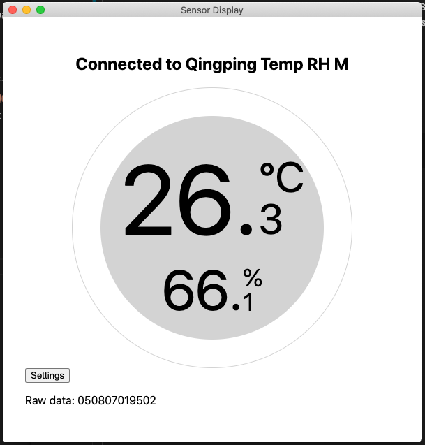

# Cleargrass Viewer

This is an Electron application to read data from [Cleargrass Temp & RH bluetooth sensors](https://www.qingping.co/temp-rh-monitor/overview) (it was tested only with the M version).

I built this to learn a bit about desktop development with Electron, Bluetooth Low Energy and in general to get some data out of this sensor after the official Android app started failing. This project was built at [NEW WORK SE Barcelona](https://www.new-work.se/en/career/barcelona) during Hackweek 16.

The application uses the [Web Bluetooth API](https://developer.mozilla.org/en-US/docs/Web/API/Web_Bluetooth_API) to discover and connect to a nearby device. There are two ways to collect information: by listening to advertising data (about 20 times per minute) which include temperature, humidity and battery information, or by enabling notifications from a GATT characteristic that includes only temperature and humidity. These two were the only sources of data that could be decoded. Other characteristics can be read but understanding them would probably require some more in-depth reverse engineering.

As listening to advertisements [seems to be deprecated](https://developer.mozilla.org/en-US/docs/Web/API/BluetoothAdvertisingData) in the Web Bluetooth specifications (and we don't need that frequency of data), I opted to enable and disable notifications at a configurable interval (default 30 seconds).

## Screenshot

## Install

Once you have cloned the repository, just run `yarn install` to get all the dependencies.

## Run in development mode

You can start the application in development mode with `yarn start`. The Dev Tools will be opened automatically together with each window.

## Build

You can package the application with `yarn package`. This uses Electron Forge to package it as an executable for your target platform.

## Known Issues

### Sensor only reading 0

Sometimes the onyl raw data that can be read is `050800000000`. When this happens I found it useful to press the button at the back of the device a couple of times and restarting the application.

### Disconnection not really handled

This is a known issue due to time constraints. Device disconnection and reconnection are not really handled at the moment.

### What other data could we extract from this sensor?

This is an open question. The device seems to be capable of storing some history data that is pulled out when syncing with the mobile app.
